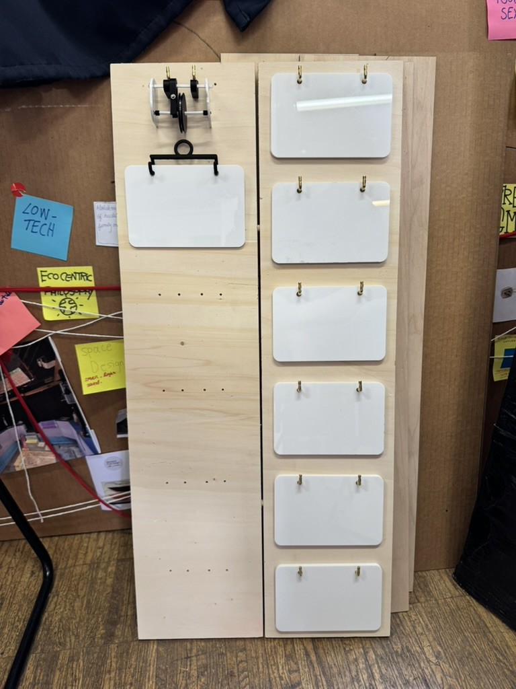
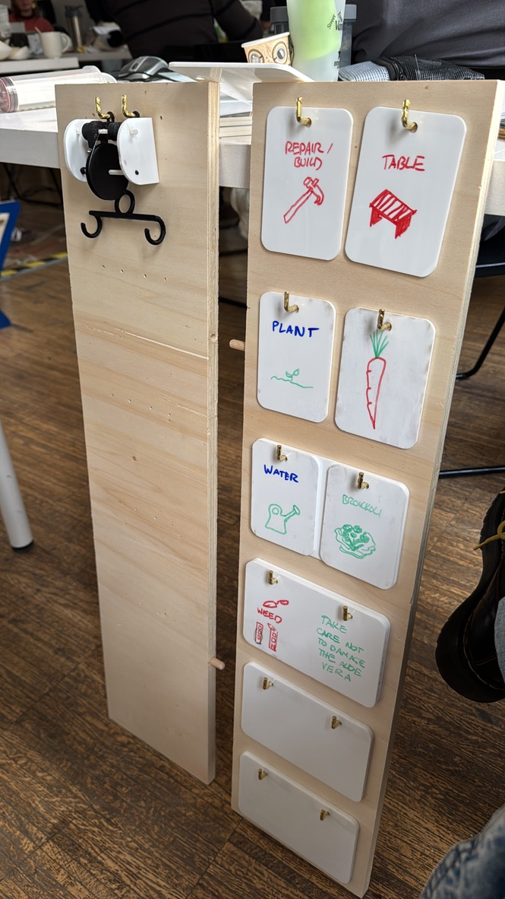

# micro-challenge-01

We designed a panel is to visually organize various tasks within a communal garden. Tasks are displayed using an acrylic card system, allowing users to write and erase different assignments as needed. The panels are modular, featuring a simple interlocking mechanism that enables them to be connected in parallel.

Our goal is not to solve any community issues, as we believe they already work effectively, and it would not be ethical to alter the workflow of such a well-established group. Instead, with this project, we aim to add value to the space, enhancing its functionality and engagement. This we want to achieve by visualizing the current state of different tasks within the garden so all it's members can easily understand what tasks need to be done at any moment.

A more detailed description of our research, process and fabrication can be found in our [article](https://www.hackster.io/530725/community-garden-management-board-2c8aef) on hackster.io.